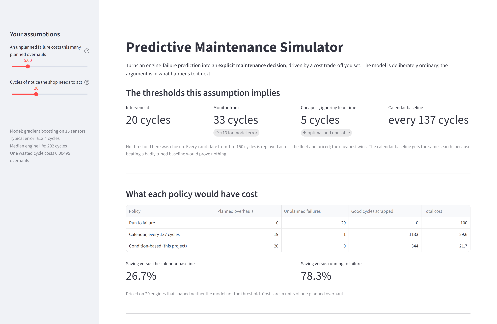
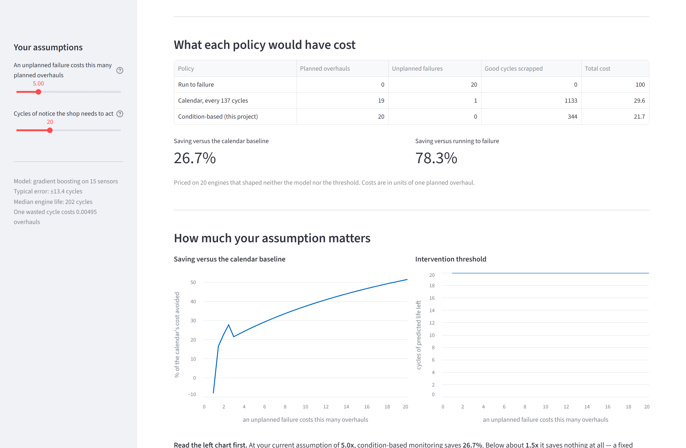

# Predictive Maintenance Simulator

Turns an engine-failure prediction into an **explicit maintenance decision**, driven by a
cost trade-off you set rather than one buried in the code.

The model is deliberately ordinary. The argument is in what happens to it next.

---

## The result

Three policies, priced on the same 20 engines — engines that shaped neither the model nor
the threshold, and were read exactly once. Costs are in units of one planned overhaul.

| Policy | Overhauls | Failures | Good cycles scrapped | Total cost |
|---|---|---|---|---|
| Run to failure | 0 | 20 | 0 | 100.0 |
| Calendar, every 137 cycles *(optimised)* | 19 | 1 | 1,133 | 29.6 |
| **Condition-based (this project)** | **20** | **0** | **344** | **21.7** |

> **26.7% cheaper than a cost-optimised calendar policy. 78.3% cheaper than running to
> failure.**

The calendar baseline gets the same optimisation pass as our own policy — beating a
deliberately badly tuned baseline would prove nothing.



---

## Why this is not another RMSE project

Most portfolio ML projects stop at "here is my accuracy". That answers a question no
business asks. This one answers the one they do ask: **given what the model predicts, what
should we do, and what does it save us?**

So the model is boring on purpose: gradient boosting on rolling sensor features, library
defaults, one fixed seed. RMSE 13.2 on the standard NASA protocol — competitive with
published classical results, about a cycle behind deep learning. That cycle changes no
decision, and [the narrative](docs/05-narrative.md) explains why.

Everything above it is where the effort went:

- Costs are **stated**, not hidden — one slider, and a curve across its whole range
- The intervention threshold is **found**, not picked — every candidate is replayed across
  the fleet and priced
- The saving is reported on a **third set of engines** that tuned nothing
- Recommendations are generated **from rules**, so the same engine always produces the same
  sentence and every clause has a line of code behind it

---

## The two things that went wrong

A project with no wrong turns is a project where nothing was really run.

### The cost-optimal policy was unusable

The optimiser's first answer was *"intervene when the model predicts 5 cycles of life
left"*. Arithmetically correct; no shop sources a part in five flights.

The cost model priced wasted life and unplanned failure but put **no value on notice**.
Adding that missing operator input did not cost anything — it made the policy **cheaper**
on unseen engines, because the knife-edge optimum had been overfitted to the engines that
chose it. → [`docs/03-decision.md`](docs/03-decision.md#3-the-finding-the-cost-optimal-policy-is-unusable)

### The premise about the slider was false

This project claimed, in three places, that moving the cost ratio moves the threshold. The
sweep says otherwise: it stops responding above 1.5x, because every engine's prediction
eventually drops below 5 cycles and a low threshold already catches the whole fleet.

> The cost ratio does not decide *when* to intervene. It decides **whether this tool is
> worth using at all** — from 8.1% *worse* than a calendar at 1.0x, to 51.3% better at 20x.

The dashboard plots the losing end of that curve too. A tool that cannot say "keep your
calendar" is a sales pitch, not an analysis.
→ [`docs/03-decision.md`](docs/03-decision.md#6-what-the-cost-ratio-actually-controls)



*Left: the saving across every cost assumption, including the negative end. Right: the
intervention threshold, flat — because the cost ratio has nothing left to buy.*

---

## Run it

Python 3.12. No API key, no network access, no per-run cost.

```powershell
python -m venv .venv
.\.venv\Scripts\Activate.ps1
pip install -r requirements.txt
```

Download the [NASA C-MAPSS archive](https://phm-datasets.s3.amazonaws.com/NASA/6.+Turbofan+Engine+Degradation+Simulation+Data+Set.zip)
and unzip the `.txt` files into `data/raw/`. They are not committed — they are large and
reproducible. Every entry point that needs them fails with the download URL rather than a
bare traceback.

```powershell
python -m src.explore      # what is in the data
python -m src.model        # train and score        (~5 s)
python -m src.decision     # the cost report
streamlit run app.py       # the dashboard
pytest                     # 71 tests
```

---

## How it is built

| Step | What it does | Code | Write-up |
|---|---|---|---|
| 0 | The cost model and decision policy, defined before any data is loaded | `src/config.py` | [scoping](docs/00-scoping.md) |
| 1 | Load and validate C-MAPSS FD001; refuse anything it does not understand | `src/data_loader.py` | [data](docs/01-data.md) |
| 2 | 91 rolling-window features, gradient-boosted RUL model | `src/features.py`, `src/model.py` | [model](docs/02-model.md) |
| 3 | Replay every candidate threshold, price it, recommend in plain words | `src/decision.py` | [decision](docs/03-decision.md) |
| 4 | Dashboard: drag the assumption, watch the answer move | `app.py` | [dashboard](docs/04-dashboard.md) |
| 5 | The trade-off, the wrong turns, the questions | — | [narrative](docs/05-narrative.md) |

Every number in every write-up is regenerated by the command at the top of that document.
Nothing is quoted from memory.

---

## What is deliberately missing

- **Fleet-level capacity.** Decisions are per-engine; the tool will happily recommend
  grounding forty engines the same week.
- **A range instead of a point.** 26.7% is one draw from one seeded split. The direction is
  robust; the second decimal place is not.
- **Real data.** C-MAPSS is a NASA simulator. Real telemetry is dirtier, and the
  degradation signal here is cleaner than anything in service.
- **Sourced costs.** The 5x failure ratio and the 20-cycle lead time are plausible, not
  measured. Both are sliders precisely because they belong to whoever runs the fleet.

The full list is in section 6 or 7 of each write-up.
